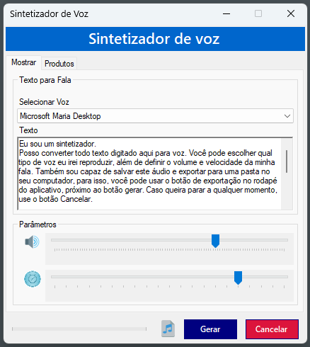

-----

# Sintetizador de Voz 🗣️

Um aplicativo de desktop simples e funcional para **Windows** que sintetiza texto em fala, permitindo reproduzir o áudio e salvá-lo como um arquivo `.wav`.



-----

## 🚀 Funcionalidades

Este projeto foi desenvolvido em **C\#** usando o **Windows Forms** e a biblioteca `System.Speech.Synthesis`, oferecendo os seguintes recursos:

  * **🎙️ Síntese de Voz:** Converte texto digitado em fala, utilizando as vozes instaladas no seu sistema operacional Windows.
  * **⚙️ Controles de Áudio:** Ajuste a **velocidade** e o **volume** da voz para personalizar a experiência.
  * **💾 Exportação para WAV:** Salve a fala sintetizada como um arquivo de áudio no formato `.wav` para uso futuro.
  * **✨ Destaque Visual:** Durante a reprodução, o texto na tela é destacado palavra por palavra, ajudando a acompanhar a leitura.

-----

## 🖼️ Exemplo de Uso

A interface é intuitiva e fácil de usar.

-----

## 🛠️ Como Usar

### Pré-requisitos

  * Um sistema operacional **Windows**.
  * **Visual Studio** (para compilar o código).

### Instruções

1.  **Clone o repositório:**
    ```bash
    git clone [Sintetizador](https://github.com/xX-Mill3r-Xx/Sintetizador)
    ```
2.  **Abra o projeto:**
      * No Visual Studio, abra a solução `Sintetizador.sln`.
3.  **Execute o projeto:**
      * Pressione `F5` ou clique em **Iniciar** para rodar a aplicação.

-----

## 📜 Detalhes Técnicos

A aplicação utiliza a classe `SpeechSynthesizer` para interagir com o motor de síntese de fala do Windows.

  * `_synthesizer.GetInstalledVoices()`: Carrega todas as vozes disponíveis no sistema.
  * `_synthesizer.SpeakAsync()`: Inicia a reprodução assíncrona do texto.
  * `_synthesizer.SpeakProgress`: Evento que monitora o progresso da fala, permitindo destacar cada palavra.
  * `_synthesizer.SetOutputToWaveFile()`: Salva o áudio gerado diretamente em um arquivo `.wav`.

A lógica de destaque visual (`AplicarDestaque`, `RemoverDestaque`) e o manuseio dos eventos de fala (`OnSpeakProgress`, `OnSpeakStarted`, `OnSpeakCompleted`) garantem uma experiência de usuário fluida e interativa.

-----

## 🤝 Contribuições

Sinta-se à vontade para abrir **issues** ou enviar **pull requests** para melhorar o projeto.
